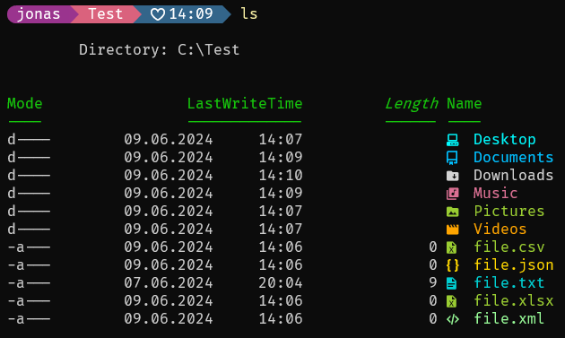
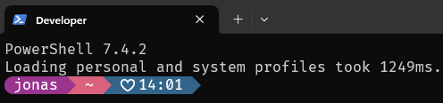
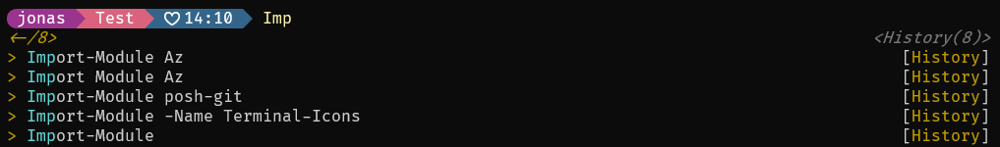
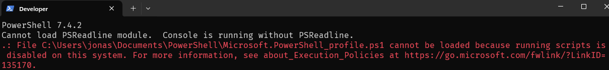

# PowerShellProfiles

## Plugins

### [Terminal-Icons](https://github.com/devblackops/Terminal-Icons)

Displays the icons you can see on the right-hand side



For installation run as administrator
```
Install-Module -Name Terminal-Icons
```

You can also take a look at the [official installation guide](https://github.com/devblackops/Terminal-Icons?tab=readme-ov-file#installation).

> [!IMPORTANT]
> You must also install [Nerd-Fonts](#nerd-fonts).

### [Nerd-Fonts](https://github.com/ryanoasis/nerd-fonts)

For installation do the following
- download a font you like from [GitHub](https://github.com/ryanoasis/nerd-fonts/releases). I use [FiraCode](https://github.com/ryanoasis/nerd-fonts/releases/download/v3.2.1/FiraCode.zip).
- unzip the files
- select all ttf-files, right-click and choose 'Install' or 'Install for all users'
- then you can select the font in Windows Terminal in the appearance-settings

You can also take a look at the [official installation guide](https://github.com/ryanoasis/nerd-fonts#font-installation).

### [Oh My Posh](https://ohmyposh.dev/)

Changes the path display to the following



There are several themes you can select from [GitHub](https://github.com/JanDeDobbeleer/oh-my-posh/tree/main/themes). I use [M365Princess](https://github.com/JanDeDobbeleer/oh-my-posh/blob/main/themes/M365Princess.omp.json). You can find them after installation in ` %USERPROFILE%\AppData\Local\Programs\oh-my-posh\themes `.

For installation run 
```
winget install JanDeDobbeleer.OhMyPosh -s winget 
```

You can also take a look at the [official installation guide](https://ohmyposh.dev/docs/installation/windows).


### [PSReadLine](https://github.com/PowerShell/PSReadLine)

Shows you suggestions and/or your history if you wish



For installation run as administrator
```
Install-Module PSReadLine -Force
```

For this representation you need ` Set-PSReadLineOption -PredictionSource History ` and ` Set-PSReadLineOption -PredictionViewStyle ListView `.

> [!TIP]
> If you want to use ` Set-PSReadLineOption -PredictionSource HistoryAndPlugin ` you need at least PowerShell version 7.1.999.


You can also take a look at the [official installation guide](https://github.com/PowerShell/PSReadLine#installation).


## Terminal Profile

To open the profile configuration
- open Windows Terminal
- select your profile in the dropdown
- type ` code $profile ` and press Enter

My personal [profile](./DeveloperProfile.ps1).

A comprehensive sample for PSReadLine you can find on [GitHub](https://github.com/PowerShell/PSReadLine/blob/master/PSReadLine/SamplePSReadLineProfile.ps1).

## Problem Solutions

### Execution Policies

In case you get an execution-policies error like that



you can check your policies with
```
Get-ExecutionPolicy -List
```

and change it with the following command (run powershell as administrator)
```
Set-ExecutionPolicy -ExecutionPolicy RemoteSigned -Scope CurrentUser
```